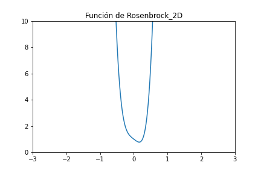
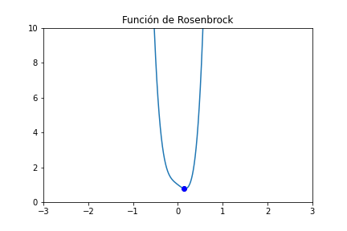
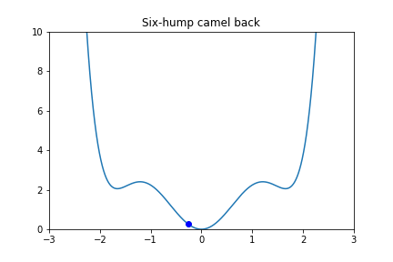
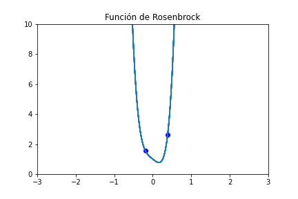
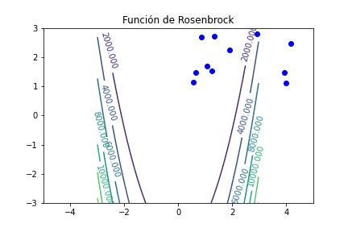
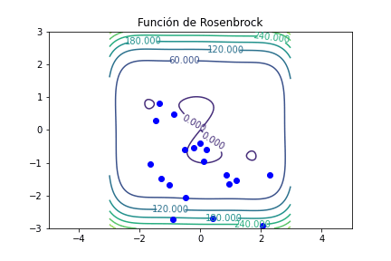
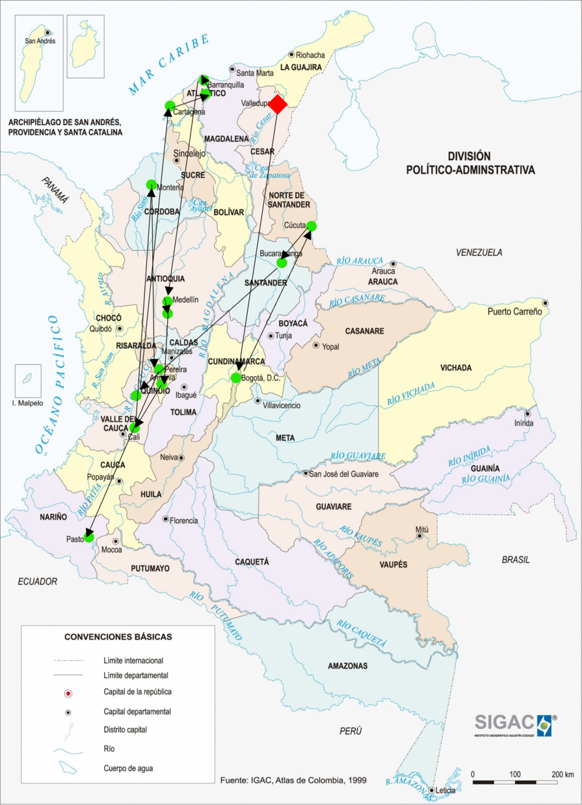
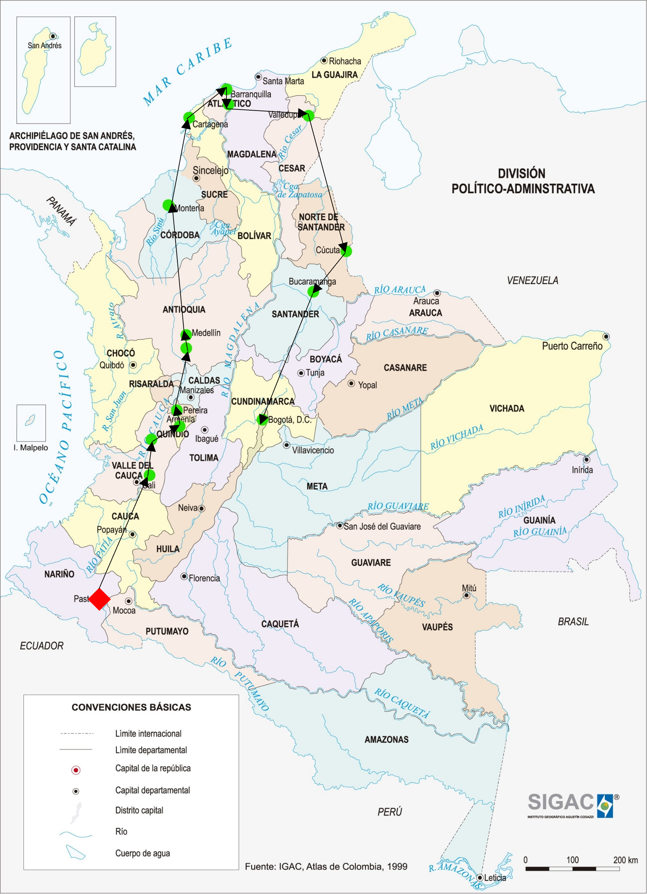

# # Actividad 07: Optimización heurística
## Sebastián Hernández Mantilla

### Optimización
#### Se tienen 2 funciones, función de Rosenbrock y función de las seis jorobas de camello, para optimizarlas en 2 y 3 dimensiones usando descenso por gradiente, algoritmos evolutivos, optimización de partículas y evolución diferencial


### Desarrollo


```python
import math
from sympy import symbols,cos,sin
from sympy import *
import sympy
import random
import numpy as np
from numpy import argmin
import numpy as np
import matplotlib.cm as cm
import matplotlib.pyplot as plt
import os
import numpy as np
import imageio

```

Con algunas variaciones de las siguientes funciones, dependiendo de la función optimizada, se crearon los gif animados 


```python
def gif(nombre_gif,nombre_graf,funcion_objetivo2d,puntos):
    X=[]
    Y=[]
    for i in range(-3000,3000):
        i = i/1000
        X.append(i)
        y_tmp = fun_objetivo2d.subs(x,i)
        Y.append(y_tmp)

    filenames = []
    for i in puntos:
        plt.xlim([-3, 3]) 
        plt.ylim([0, 10]) 
        plt.title(nombre_graf) 

        plt.plot(X, Y, color ='tab:blue')

        plt.plot(i, fun_objetivo2d.subs(x,i),'bo')
        # create file name and append it to a list
        filename = f'{i}.png'
        filenames.append(filename)
        
        
        # save frame
        plt.savefig(filename)
        plt.close()
    # build gif
    with imageio.get_writer(nombre_gif, mode='I') as writer:
        for filename in filenames:
            image = imageio.imread(filename)
            writer.append_data(image)

    # Remove files
    for filename in set(filenames):
        os.remove(filename)
```


```python
def gif3d(nombre_gif,nombre_graf,funcion_objetivo,puntos):
    filenames = []
    for i in puntos:
        delta = 0.025
        X1 = np.arange(-2.048, 2.048, delta)
        X2 = np.arange(-2.048, 2.048, delta)
        X1, X2 = np.meshgrid(X1, X2)
        #Z1 = np.exp(-X**2 - Y**2)
        #Z2 = np.exp(-(X - 1)**2 - (Y - 1)**2)
        Z = 100*X1**4-200*X1**2*X2+x1**2-2*X1+100*X2**2+1
        #Z = (Z1 - Z2) * 2
        fig, ax = plt.subplots()
        CS = ax.contour(X1, X2, Z)
        ax.clabel(CS, inline=True, fontsize=10)
        ax.set_title('Función de Rosenbrock')
        # plot the line chart
        plt.plot(i[0], i[1],'bo')
        #plt.ylim(20,50)

        # create file name and append it to a list
        filename = f'{i}.png'
        filenames.append(filename)

        # save frame
        plt.savefig(filename)
        plt.close()
    # build gif
    with imageio.get_writer('mygif.gif', mode='I') as writer:
        for filename in filenames:
            image = imageio.imread(filename)
            writer.append_data(image)
        
    # Remove files
    for filename in set(filenames):
        os.remove(filename)
```

### Descenso por gradiente

#### Función para superficies


```python
# funcion de descenso por gradiente

def optimization3d(x,y,fun,ite,eta):
    
    p_v = [x,y]
    p_n = [x,y]
        
    x1, x2 = symbols('x1 x2')
    
    points = []
    
    der_x1 = diff(fun,x1)
    der_x2 = diff(fun,x2)
    for i in range(ite):
        der_vect = np.array([der_x1.subs([(x1,p_v[0]),(x2,+p_v[1])]),der_x2.subs([(x1,p_v[0]),(x2,+p_v[1])])])
        der_vect = der_vect/sqrt(np.sum(der_vect**2)) 
        p_n[0] = p_v[0] - der_vect[0] * eta
        p_n[1] = p_v[1] - der_vect[1] * eta
        
        p_v = p_n
        result = fun.subs([(x1,p_n[0]),(x2,p_n[1])])
        #print('result:',result)
        #print(p_n)
        points.append(p_v.copy())
    #print('result:',result)
    return points
```

#### Función para planos


```python
def optimization2d(x_ini,fun,ite,eta):
    
    x = symbols('x')
    der = diff(fun,x)
    #print('der: ',der)
    p_v = x_ini
    p_n = x_ini
    count = 0
    points=[]
    while count < ite :
        #print('der.subs([(x,p_v)])*eta: ',der.subs([(x,p_v)])*eta)
        p_n = p_v - der.subs([(x,p_v)])*eta
        p_v = p_n
        count = count+1
        points.append(p_v)

    return points
```

### Función de Rosenbrock: 
- f(x1,x2)=100(x2−x1^2)^2+(1−x1)^2, xi∈[−2.048,2.048], i=1,2. Alcanza su valor mínimo en x1=1 y x2=1.


```python
x1, x2 = symbols('x1 x2')
fun = 100*(x2**2-2*x1**2*x2+x1**4)+(1-2*x1+x1**2)


x1 = random.randint(-2048,2048)/1000
x2 = random.randint(-2048,2048)/1000
res = []
res = optimization3d(x1,x2,fun,1000,0.005)
```


```python
gif3d('f1_3d_DG.gif','Función de Rosenbrock',fun,res)
```


### Función de Rosenbrock - Optimización en 2D
- f(x1) = 100 x^4 + (1- 2x + x^2), se iguala x2 a 0


```python
x = symbols('x')
fun_objetivo2d = 100*x**4+(1-2*x+x**2)

x_ini = random.randint(-2048,2048)/1000
res = optimization2d(x_ini,fun_objetivo2d,500,0.001)

```


```python
gif3d('f1_3d_DG.gif','Función de Rosenbrock',fun,res)
```


### Función de las seis jorobas de camello: 
- f(x1,x2)=(4−2.1x1^2+x1^4/3)x1^2+x1x2+(−4+4x2^2)x2^2, x1∈[−3,3] y x2∈[−2,2]. Alcanza su valor mínimo en x1=−0.0898 y x2=0.7126 y también en x1=0.0898 y x2=0.7126.
### Optimización en 3D


```python
x1, x2 = symbols('x1 x2')
fun = (4 - 2.1*x1**2 + x1**4/3)*x1**2+x1*x2+(-4+4*x2**2)*x2**2

x1 = random.randint(-3000,3000)/1000
x2 = random.randint(-2000,2000)/1000
res = []
res = optimization3d(x1,x2,fun,1000,0.005)
```


```python
gif3d('f1_3d_DG.gif','Función de Rosenbrock',fun,res)
```


### Función de las seis jorobas de camello: 
- f(x1) = (4−2.1x1^2+x1^4/3)x1^2, se iguala x2 a 0
### Optimización en 2D


```python
x = symbols('x')
fun_objetivo2d = (4-2.1*x**2+(x**4)/3)*x**2

x_ini = random.randint(-3000,3000)/1000
res = optimization2d(x_ini,fun_objetivo2d,500,0.001)
```


### Algoritmos genéticos

#### Funciones para planos:
- pop_gen: crea una poblacion nueva de individuos
- fitness_ev : evalua una población con la función objetivo del problema
- selection : selecciona 3 individuos al azar en la población y escoge el mejor encontrado
- crossover2 : a partir de 2 individuos padres se generan 2 individuos mas usando la función indNuevo=Padre1-random()*(Padre1-Padre2)
- mutation : escoge un individuo al azar y lo multiplica por un porcentaje    


```python
#funcion para terner una poblacion inicial
def pop_gen(pop_size,lim):
    res = []
    for i in range(0,pop_size):
        #pt_tmp = random.randint(-2048,2048)/1000
        pt_tmp = random.randint(lim[0],lim[1])/1000
       
        res.append(pt_tmp)
    return res    
```


```python
#Funcion para encontrar el fitness de cada individuo en la población
def fitness_ev(population,fun):
    fitness = []
    for j in population:
        fitness_ = fun.subs([(x,j)])
        key = str(fitness_)
        
        fitness.append(fitness_)
    return fitness

```


```python
#Funcion para seleccionar los padres de la poblacion por fitness
def selection(pop,fitness,p_cant):
    #fit_list = sorted(list(fitness.keys()))
    #print('fit_list:',fit_list)
    parents = []
    for j in range(0,len(pop)):
        c1 = random.randint(0,len(pop)-1)
        c2 = random.randint(0,len(pop)-1)
        c3 = random.randint(0,len(pop)-1)
        candidates=[c2,c3]
        best = c1
        #print('candidates',candidates,best)
        for i in candidates:
            if fitness[i] < fitness[best]:
                best = i
        best = population[best]
        parents.append(best)
    return parents
    
```


```python
#Funcion para hacer las combinaciones de los padres y encontrar nuevos hijos

def crossover2(par1,par2):

    c1 = par1-random.random()*(par1-par2)
    c2 = par2-random.random()*(par2-par1)
    
    return[c1,c2] 

```


```python
#Funcion para hacer las mutaciones
def mutation(population):
    pos = random.randint(0,len(population)-1)
    population[pos] = population[pos] * random.random() * random.randint(-1,1)
    return population
```

### Función de Rosenbrock - Optimización 2d
- f(x1) = 100 x^4 + (1- 2x + x^2), se iguala x2 a 0


```python
pop_size = 24
itera = 100
x = symbols('x')

x = symbols('x')
fun_objetivo2d = 100*x**4+(1-2*x+x**2)

population = pop_gen(pop_size,[-2048,2048])
puntos=[]
for i in range(0,itera):
    
    fitness = fitness_ev(population,fun_objetivo2d)
    #print('fitness',len(fitness))
    selec = selection(population,fitness,6)
    #print('selec',selec)
    uniones = []
    #print('pop_size',pop_size)
    
    for i in range(0,int(len(selec)/2)):
        p1 = selec[i]
        p2 = selec[i+1]
        
        p1,p2 = crossover2(p1,p2)
        #p1,p2 = p1/1000,p2/1000
        uniones.append(p1)
        uniones.append(p2)
        population = uniones
        population = mutation(population)
    #print('population: ',population)
    puntos.append(population[argmin(fitness)])
fitness = fitness_ev(population,fun_objetivo2d)
selec = selection(population,fitness,6)

```



#### Funciones para superficies:
- pop_gen: crea una poblacion nueva de individuos
- fitness_ev : evalua una población con la función objetivo del problema
- selection : selecciona 5 individuos al azar en la población y escoge el mejor encontrado
- crossover2 : a partir de 2 individuos padres se genera 1 individuo mas usando la función indNuevo=Padre1-random()*(Padre1-Padre2)
- mutation : escoge un individuo al azar y lo multiplica por un porcentaje  

A diferencia del algoritmo en 2d, para 3d se obtuvieron mejores resultados al eliminar uno de los individuos con los que se hace el crossover, por esto en el crossover solo se genera 1 individuo adicional


```python
#funcion para terner una poblacion inicial
def pop_gen_3d(pop_size,lim):
    res = []
    for i in range(0,pop_size):
        
        pt_x1 = random.randint(-2048,2048)/1000
        pt_x2 = random.randint(-2048,2048)/1000
        point = [pt_x1,pt_x2]
        if point in res:
            i=i-1
        #pt_tmp = random.randint(0,4096)/1000
        res.append(point)
        
    return res  
```


```python
#Funcion para encontrar el fitness de cada individuo en la población
def fitness_ev_3d(population,fun):
    fitness = []
    #print('pop en fitness',population)
    for j in population:
        fitness_ = fun.subs([(x1,j[0]),(x2,j[1])])
        fitness.append(fitness_)        
    return fitness
```


```python
#Funcion para seleccionar los padres de la poblacion por fitness
def selection_3d(population,fitness,p_cant):
    #fit_list = sorted(list(fitness.keys()))
    #print('fit_list:',fit_list)
    parents = []
    for i in range(0,len(population)):
        c1 = random.randint(0,len(fitness)-1)
        c2 = random.randint(0,len(fitness)-1)
        c3 = random.randint(0,len(fitness)-1)
        c4 = random.randint(0,len(fitness)-1)
        candidates=[c2,c3,c4]
        best = c1
        #print('candidates',candidates,best)
        for i in candidates:
            if fitness[i] < fitness[best]:
                best = i
        
        best = population[best]
        parents.append(best)
    
    return parents
```


```python
#Funcion para hacer las combinaciones de los padres y encontrar nuevos hijos

def crossover_3d(par1,par2):
    c1,c2 = par1,par2
    
    loc1 = random.randint(0,1)
    loc2 = [0 if loc1 ==1 else 1][0]
    c1_new = [c1[loc1],c2[loc2]]
       
    #c1_new = [c1[0],c2[1]]
    #c2_new = [c2[0],c1[1]]
    
    return c1_new 
```


```python
def mutation_3d(population):
    cant = int(len(population)*0.1)
    if cant<1:
        cant=1
        
    for i in range(0,cant):
        
        pos = random.randint(0,len(population)-1)
        loc = random.randint(0,1)
        
        population[pos][loc] = population[pos][0] * random.random() * random.randint(-1,1)
    
    return population
```

### Función de Rosenbrock - Optimización 3d
- f(x1,x2)=100(x2−x1^2)^2+(1−x1)^2, xi∈[−2.048,2.048], i=1,2. Alcanza su valor mínimo en x1=1 y x2=1.


```python
pop_size = 24
itera = 200
x1, x2 = symbols('x1 x2')
fun_objetivo = 100*(x2**2-2*x1**2*x2+x1**4)+(1-2*x1+x1**2)
fun = 100*(x2**2-2*x1**2*x2+x1**4)+(1-2*x1+x1**2)

population = pop_gen_3d(pop_size,1)
puntos = []
for i in range(0,itera):
    
    fitness = fitness_ev_3d(population,fun_objetivo)
    selec = selection_3d(population,fitness,6)
    uniones = []
    
    for i in range(0,len(selec)-1,2):
        
        p1 = selec[i]
        p2 = selec[i+1]
        if fitness_ev_3d([p1],fun_objetivo) <=  fitness_ev_3d([p2],fun_objetivo):
            #print('ENTRA A 1',p1)
            
            uniones.append(p1)
        else:
            #print('ENTRA A 2',p2)
            uniones.append(p2)
        #print('Uniones',uniones)  
        p_new = crossover_3d(p1,p2)
        
        uniones.append(p_new)
        #uniones.append(p_new2)
        population = uniones
    population = mutation_3d(population)
    fitness_p = fitness_ev_3d(population,fun_objetivo)
    puntos.append(population[argmin(fitness_p)])
    
fitness = fitness_ev_3d(population,fun_objetivo)
selec = selection_3d(population,fitness,6)

```


### Función de las seis jorobas de camello:
- f(x1) = (4−2.1x1^2+x1^4/3)x1^2, se iguala x2 a 0
#### Optimización en 2D


```python
pop_size = 24
itera = 20

x = symbols('x')
fun_objetivo2d = (4-2.1*x**2+(x**4)/3)*x**2


#fun_objetivo = 100*(x2**2-2*x1**2*x2+x1**4)+(1-2*x1+x1**2)

# Se elimina x2 y se mueve la ecuación hacia el lado positivo del eje x
#fun_objetivo2d = 100*(x-2.048)**4+(1-2*(x-2.048)+(x-2.048)**2)
#fun_objetivo2d = (x-2)**2

population = pop_gen(pop_size,[2500,3000])
#print('population1',population)
fitness = fitness_ev(population,fun_objetivo2d)
puntos=[]
puntos.append(population[argmin(fitness)])
puntos = puntos*2 
for i in range(0,itera):
    
    fitness = fitness_ev(population,fun_objetivo2d)
    #print('fitness',len(fitness))
    selec = selection(population,fitness,6)
    #print('selec',selec)
    uniones = []
    #print('pop_size',pop_size)
    
    for i in range(0,int(len(selec)/2)):
        p1 = selec[i]
        p2 = selec[i+1]
        #p1 = random.choice(selec)
        #p2 = random.choice(selec)
        #print('p1p2:',p1,p2)
        p1,p2 = crossover2(p1,p2)
        #p1,p2 = p1/1000,p2/1000
        uniones.append(p1)
        uniones.append(p2)
        population = uniones
        population = mutation(population)
    #print('population: ',population)
    puntos.append(population[argmin(fitness)])
fitness = fitness_ev(population,fun_objetivo2d)
selec = selection(population,fitness,6)
```


### Función de las seis jorobas de camello:
- f(x1,x2)=(4−2.1x1^2+x1^4/3)x1^2+x1x2+(−4+4x2^2)x2^2, x1∈[−3,3] y x2∈[−2,2]. Alcanza su valor mínimo en x1=−0.0898 y x2=0.7126 y también en x1=0.0898 y x2=0.7126.
#### Optimización en 3D


```python
pop_size = 24
itera = 200
x1, x2 = symbols('x1 x2')
fun_objetivo = (4 - 2.1*x1**2 + x1**4/3)*x1**2+x1*x2+(-4+4*x2**2)*x2**2

population = pop_gen_3d(pop_size,1)
puntos = []
for i in range(0,itera):
    
    fitness = fitness_ev_3d(population,fun_objetivo)
    selec = selection_3d(population,fitness,6)
    uniones = []
    #print('pop_size',pop_size)
    
    for i in range(0,len(selec)-1,2):
        
        p1 = selec[i]
        p2 = selec[i+1]
        
        if fitness_ev_3d([p1],fun_objetivo) <=  fitness_ev_3d([p2],fun_objetivo):
            
            uniones.append(p1)
        else:
            uniones.append(p2)
          
        p_new = crossover_3d(p1,p2)
        
        uniones.append(p_new)
        #uniones.append(p_new2)
        population = uniones
    population = mutation_3d(population)
    fitness_p = fitness_ev_3d(population,fun_objetivo)
    puntos.append(population[argmin(fitness_p)])
    
fitness = fitness_ev_3d(population,fun_objetivo)
selec = selection_3d(population,fitness,6)

```


### Evolución diferencial


#### Funciones para 2d y 3d
En evolución diferencial se tiene un vector con candidatos que cambia en cada iteración del algoritmo, para cada iteración se recorren los candidatos del vector, se escogen 3 candidatos diferentes al azar, con estos se genera una mutación, se hace un crossover con el candidato de la iteración se evalua el fitness y se escoge uno de los 2.
Se presentan las funciones utilizadas


```python
# Funciones Evolución Diferencial

def pop_gen_DE(pop_size,lim):
    
    res = []
    for i in range(0,pop_size):    
        pt_x1 = random.randint(-2048,2048)/1000
        #pt_x2 = random.randint(-2048,2048)/1000
        #point = [pt_x1,pt_x2]
        point = pt_x1
        if point in res:
            i=i-1
        #pt_tmp = random.randint(0,4096)/1000
        res.append(point)
    return res  


def mutation(x, F):
    return x[0] + F * (x[1] - x[2])


# define crossover operation
def crossover2d(mutated, target, dims, cr):
    # generate a uniform random value for every dimension
    p = random.random()
    #p = rand(dims)
    # generate trial vector by binomial crossover
    if p<cr:
        trial = mutated
    else:
        trial = target
    return trial

                 
def fitness_DE(population,fun):
    fitness = []
    for j in population:
        fitness_ = fun.subs([(x,j)])
        key = str(fitness_)
        
        fitness.append(fitness_)
    return fitness

######## Funciones para 3D #######
def pop_gen_DE_3d(pop_size,lim):
    
    res = []
    for i in range(0,pop_size):    
        pt_x1 = random.randint(lim[0][0],lim[0][1])/1000
        pt_x2 = random.randint(lim[1][0],lim[1][1])/1000
        point = [pt_x1,pt_x2]
        #point = pt_x1
        if point in res:
            i=i-1
        #pt_tmp = random.randint(0,4096)/1000
        res.append(point)
    return res  

def fitness_DE_3d(population,fun):
    fitness = []
    for j in population:
        fitness_ = fun.subs([(x1,j[0]),(x2,j[1])])
        #key = str(fitness_)
        
        fitness.append(fitness_)
    return fitness

def crossover3d(mutated, target, dims, cr):
    # generate a uniform random value for every dimension
    p1 = random.random()
    p2 = random.random()
    
    #p = rand(dims)
    # generate trial vector by binomial crossover
    trial = target
    if p1<cr:
        trial[0] = mutated[0]
    else:
        trial[0] = target[0]
        
    if p2<cr:
        trial[1] = mutated[1]
    else:
        trial[1] = target[1]
    return trial

def mutation3d(x, F):
    return [x[0][0] + F * (x[1][0] - x[2][0]),x[0][1] + F * (x[1][1] - x[2][1])]

```

### Función de Rosenbrock - Optimización 2d
- f(x1) = 100 x^4 + (1- 2x + x^2), se iguala x2 a 0


```python
pop_size = 10
iter = 100 # define number of iterations
F = 0.5 # define scale factor for mutation
cr = 0.7 # define crossover rate for recombination
dims = 1

population = pop_gen_DE(pop_size,1)

fun_objetivo2d = 100*x**4+(1-2*x+x**2)
#fun_objetivo2d = x**2

results = fitness_DE(population,fun_objetivo2d)
prev_res = min(results)
try_ind = argmin(results)
prev_try = population[try_ind] 
puntos = []
puntos.append(prev_try)
#print('puntos',puntos)
for i in range(0,iter):
    for j in range(len(population)):
        tar = population[j]
        
        candidates = [candidate for candidate in range(pop_size) if candidate != j]
        cands = []
        cands.append(population[random.choice(candidates)])
        cands.append(population[random.choice(candidates)])
        cands.append(population[random.choice(candidates)])
        #print('candidates',cands)
        mut = mutation(cands,F)
        
        cross = crossover2d(mut, tar, dims, cr)
        vect = [cross,population[j]]
        trial,target = fitness_DE(vect,fun_objetivo2d)
        #print('trial',trial)
        #print('target',target)
        if trial<target:
            population[j] = cross
            results[j] = trial
            
    best_res = min(results)
    #print(best_res)
    if best_res < prev_res:
        best_try = population[argmin(results)]
        best_res = best_res
        #print('best_try',best_try)
        puntos.append(best_try)
        # report progress at each iteration
        #print('Iteration: %d f([%s]) = %.5f' % (i, best_try, best_res))
    
```



### Función de las seis jorobas de camello:
- f(x1) = (4−2.1x1^2+x1^4/3)x1^2, se iguala x2 a 0
#### Optimización en 2D


```python
pop_size = 10
iter = 30 # define number of iterations
F = 0.5 # define scale factor for mutation
cr = 0.7 # define crossover rate for recombination
dims = 1

population = pop_gen_DE(pop_size,1)

fun_objetivo2d = (4-2.1*x**2+(x**4)/3)*x**2
#fun_objetivo2d = x**2

results = fitness_DE(population,fun_objetivo2d)
prev_res = min(results)
try_ind = argmin(results)
prev_try = population[try_ind] 
puntos = []
puntos.append(prev_try)
#print('puntos',puntos)
for i in range(0,iter):
    for j in range(len(population)):
        tar = population[j]
        
        candidates = [candidate for candidate in range(pop_size) if candidate != j]
        cands = []
        cands.append(population[random.choice(candidates)])
        cands.append(population[random.choice(candidates)])
        cands.append(population[random.choice(candidates)])
        #print('candidates',cands)
        mut = mutation(cands,F)
        
        cross = crossover2d(mut, tar, dims, cr)
        vect = [cross,population[j]]
        trial,target = fitness_DE(vect,fun_objetivo2d)
        #print('trial',trial)
        #print('target',target)
        if trial<target:
            population[j] = cross
            results[j] = trial
            
    best_res = min(results)
    #print(best_res)
    if best_res < prev_res:
        best_try = population[argmin(results)]
        best_res = best_res
        #print('best_try',best_try)
        puntos.append(best_try)
        # report progress at each iteration
        #print('Iteration: %d f([%s]) = %.5f' % (i, best_try, best_res))
    
```



### Optimización de partículas

#### Funciones para planos:
- pop_gen_PSO_2d : crea una poblacion nueva de individuos
- fitness_PSO_2d : evalua una población con la función objetivo del problema
- velypos_2d : se calcula la nueva velocidad y posición de cada particula, la velocidad esta dada por la siguiente ecuación:

#####  v(t+1) = w * v(t) + c1 * r1 * {xi'(t) - xi(t)} +  c2 * r2 * { g(t) - xi(t)}
Donde 
w -> es la inercia del sistema, este coeficiente determina la aceleración o desaceleración de las partículas, en  este caso se escogió un w = 0.8
c1 -> determina que tanto una particula sigue la mejor posición alcanzada individualmente
c2 -> determina que tanto una particula sigue la mejor posición alcanzada por el enjambre
xi'(t) -> mejor posición alcanzada por la particula
g(t) -> mejor posición alcanzada por el enjambre

La posición nueva se calcula con:
#####  xi(t+1) = x(t) + v(t+1)


```python

def pop_gen_PSO_2d(pop_size,lim):
    
    res = []
    for i in range(0,pop_size):
        
        pt_x1 = random.randint(-2048,2048)/1000
        #pt_x2 = random.randint(-2048,2048)/1000
        point = pt_x1
        if point in res:
            i=i-1
        #pt_tmp = random.randint(0,4096)/1000
        res.append(point)
        
    return res  

def fitness_PSO_2d(population,fun):
    fitness = []
    for j in population:
        fitness_ = fun.subs([(x,j)])
                
        fitness.append(fitness_)
    return fitness

def velypos_2d(inertia,c1_cog,c2_soc,best_position,prev_velocity,prev_position,results):
    
    bestSP = prev_position[argmin(results)]
    
    for i in range(len(prev_position)):
        vel = inertia*prev_velocity[i]+c1_cog*(best_position[i]-prev_position[i])+c2_soc*(bestSP-prev_position[i])
        #vel_1 = inertia*prev_velocity[i][1]+c1_cog*(best_position[i][1]-prev_position[i][1])+c2_soc*(bestSP[1]-prev_position[i][1])
       
        new_pos = prev_position[i]+vel
        
        prev_velocity[i] = vel
        prev_position[i] = new_pos
    return prev_velocity,prev_position
```

### Función de Rosenbrock :
- f(x1) = 100 x^4 + (1- 2x + x^2), se iguala x2 a 0
#### Optimización en 2D


```python
iter_ = 100
fun_objetivo2d = 100*(x)**4+(1-2*(x)+(x)**2)
pop_size = 10
inertia = 0.8
c1_cog = 2
c2_soc = 2

prev_position = pop_gen_PSO_2d(pop_size,1)
results = fitness_PSO_2d(prev_position,fun_objetivo2d)
best_position = prev_position
best_results = results
prev_velocity = [0]*pop_size
puntos=[]
puntos.append(prev_position.copy())
for i in range(iter_):
    
    prev_velocity,prev_position = velypos_2d(inertia,c1_cog,c2_soc,best_position,prev_velocity,prev_position,results)
    #print('prev_velocity: ',prev_velocity)
    results = fitness_PSO_2d(prev_position,fun_objetivo2d)
    #print('results: ',results)
    for j in range(len(prev_position)):
        if results[j] < best_results[j]:
            best_position[j] = prev_position[j]
            best_results[j] = results[j]
    puntos.append(prev_position.copy())
```



#### Funciones para superficies:
- pop_gen_PSO_3d : crea una poblacion nueva de individuos
- fitness_PSO_3d : evalua una población con la función objetivo del problema
- velypos_3d : se calcula la nueva velocidad y posición de cada particula, la velocidad esta dada por la ecuación explicada anteriormente


```python
# crear una poblacion
def pop_gen_PSO_3d(pop_size,lim):
    
    res = []
    for i in range(0,pop_size):
        
        pt_x1 = random.randint(-2048,2048)/1000
        pt_x2 = random.randint(-2048,2048)/1000
        point = [pt_x1,pt_x2]
        if point in res:
            i=i-1
        #pt_tmp = random.randint(0,4096)/1000
        res.append(point)
        
    return res  

#Evaluación del objetivo
def fitness_PSO_3d(population,fun):
    fitness = []
    for j in population:
        fitness_ = fun.subs([(x1,j[0]),(x2,j[1])])
        key = str(fitness_)
        
        fitness.append(fitness_)
    return fitness

#Calculo de velocidad y posición
def velypos_3d(inertia,c1_cog,c2_soc,best_position,prev_velocity,prev_position,results):
    
    bestSP = prev_position[argmin(results)]
    
    for i in range(len(prev_position)):
        vel_0 = inertia*prev_velocity[i][0]+c1_cog*(best_position[i][0]-prev_position[i][0])+c2_soc*(bestSP[0]-prev_position[i][0])
        #print('bestSP,prev_position: ',bestSP,prev_position[i])
        #print('c2_soc*abs(bestSP[0]-prev_position[i][0]): ',c2_soc*abs(bestSP[0]-prev_position[i][0]))
        vel_1 = inertia*prev_velocity[i][1]+c1_cog*(best_position[i][1]-prev_position[i][1])+c2_soc*(bestSP[1]-prev_position[i][1])
        #print('vel_0: ',vel_0)
        #print('vel_1: ',vel_1)
        new_pos_0 = prev_position[i][0]+vel_0
        new_pos_1 = prev_position[i][1]+vel_1
        
        prev_velocity[i] = [vel_0,vel_1]
        prev_position[i] = [new_pos_0,new_pos_1]
    return prev_velocity,prev_position
```

### Función de Rosenbrock :
-  f(x1,x2)=100(x2−x21)2+(1−x1)2, xi∈[−2.048,2.048], i=1,2.
#### Optimización en 3D


```python
pop_size = 20
iter_ = 60

fun_objetivo = 100*(x2**2-2*x1**2*x2+x1**4)+(1-2*x1+x1**2)
inertia = 0.8
c1_cog = 2
c2_soc = 2

prev_position = pop_gen_PSO_3d(pop_size,1)
results = fitness_PSO_3d(prev_position,fun_objetivo)
best_position = prev_position
best_results = results
prev_velocity = [[0,0]]*pop_size
puntos = []
#puntos.append(prev_position)
#print(puntos)
for i in range(iter_):
    
    prev_velocity,prev_position = velypos_3d(inertia,c1_cog,c2_soc,best_position,prev_velocity,prev_position,results)
    #print('prev_velocity: ',prev_position)
    results = fitness_PSO_3d(prev_position,fun_objetivo)
    #print('results: ',results)
    for j in range(len(prev_position)):
        if results[j] < best_results[j]:
            best_position[j] = prev_position[j]
            best_results[j] = results[j]
    puntos.append(prev_position.copy())
    #print('prev_position',prev_position)
    #print('results',results)
    
```



### Función de las seis jorobas de camello:
- f(x1) = (4−2.1x1^2+x1^4/3)x1^2, se iguala x2 a 0
#### Optimización en 2D


```python
iter_ = 100
fun_objetivo2d = (4-2.1*x**2+(x**4)/3)*x**2
pop_size = 10
inertia = 0.8
c1_cog = 2
c2_soc = 2

prev_position = pop_gen_PSO_2d(pop_size,1)
results = fitness_PSO_2d(prev_position,fun_objetivo2d)
best_position = prev_position
best_results = results
prev_velocity = [0]*pop_size
puntos=[]
puntos.append(prev_position.copy())
for i in range(iter_):
    
    prev_velocity,prev_position = velypos_2d(inertia,c1_cog,c2_soc,best_position,prev_velocity,prev_position,results)
    #print('prev_velocity: ',prev_velocity)
    results = fitness_PSO_2d(prev_position,fun_objetivo2d)
    #print('results: ',results)
    for j in range(len(prev_position)):
        if results[j] < best_results[j]:
            best_position[j] = prev_position[j]
            best_results[j] = results[j]
    puntos.append(prev_position.copy())
```


### Función de las seis jorobas de camello:
- f(x1,x2)=(4−2.1x1^2+x1^4/3)x1^2+x1x2+(−4+4x2^2)x2^2, x1∈[−3,3] y x2∈[−2,2]. Alcanza su valor mínimo en x1=−0.0898 y x2=0.7126 y también en x1=0.0898 y x2=0.7126.
#### Optimización en 3D


```python
pop_size = 20
iter_ = 60

fun_objetivo = (4 - 2.1*x1**2 + x1**4/3)*x1**2+x1*x2+(-4+4*x2**2)*x2**2  
inertia = 0.8
c1_cog = 2
c2_soc = 2

prev_position = pop_gen_PSO_3d(pop_size,1)
results = fitness_PSO_3d(prev_position,fun_objetivo)
best_position = prev_position
best_results = results
prev_velocity = [[0,0]]*pop_size
puntos = []
#puntos.append(prev_position)
#print(puntos)
for i in range(iter_):
    
    prev_velocity,prev_position = velypos_3d(inertia,c1_cog,c2_soc,best_position,prev_velocity,prev_position,results)
    #print('prev_velocity: ',prev_position)
    results = fitness_PSO_3d(prev_position,fun_objetivo)
    #print('results: ',results)
    for j in range(len(prev_position)):
        if results[j] < best_results[j]:
            best_position[j] = prev_position[j]
            best_results[j] = results[j]
    puntos.append(prev_position.copy())
    #print('prev_position',prev_position)
    #print('results',results)
```



##### En el gif se muestra como la solución converge a un mínimo local

## El problema del vendedor viajero

Se escoge el camión NHR Chevrolet reward como vehículo para desarrollar este punto, este modelo tiene un rendimiento de 14.5 km por galón.
Según un informe de talent.com (https://co.talent.com/salary?job=conductor), el salario mensual promedio para un conductor es de 1.022.191 COP, lo que representan 6.290 COP por hora.
De google maps se obtuvieron las distancias, (por carretera), entre todas las ciudades, y el tiempo esperado para hacer cada recorrido.
El precio de un galón de gasolina en Colombia es COP 8,525.122. En peaje se encontró que para el 2011 en promedio, por kilometro, en Colombia se pagaban 72 pesos.
Con esto la función a minimizar es:
##### f_obj = {(Distancia * 8525.122)/14.5} + {6290 * TiempoHoras} + {72 * Distancia}

### Solución con algoritmos genéticos

##### Para la solución:
- Se ordenan las ciudades y las distancias y tiempos se pasan a dataframes, de esta forma se facilita el cálculo de la función objetivo ya que para extraer un valor la notación es: df_tiempo[i,j], i y j se refieren a ciudades dependiendo del orden que se les dió
- Se replantean las funciones mostradas anteriormente debido a que para este caso no es posible tener 2 o mas ciudades repetidas


```python
#Se llama las distancias y los tiempos 
import pandas as pd
df_tiempo = pd.read_excel('tiempos.xlsx')
df_distancia = pd.read_excel('distancias.xlsx')
```

#### Funciones algoritmos genéticos, problema del viajero vendedor

Se cambia la función de crossover por breed; esta función, apartir de dos candidatos, escoge aleatoriamente una parte del primero y crea un nuevo vector rellenando el resto de los espacios con los valores del segundo sin repetir.
Se cambia también la funcion de mutation, en este caso solo intercambia los valores de un vector en dos de sus posiciones escogidas al azar


```python

#funcion para terner una poblacion inicial
def pop_gen_vv(pop_size,lim):
    res = []
    for i in range(0,pop_size):
        #pt_tmp = random.randint(-2048,2048)/1000
        iterable = [1,2,3,4,5,6,7,8,9,10,11,12,13,14,15]
        ind = random.sample(iterable,15)
        res.append(ind)
    return res 

#Funcion para encontrar el fitness de cada individuo en la población
def fitness_vv(population):
    fitness = []
    
    for j in range(len(population)):
        ind = population[j]
        sum_=0
        #print(ind)
        for i in range(len(ind)-1):
            #print('ind[i]',ind[i])
            sum_tmp = (df_distancia.iloc[ind[i],ind[i+1]]*8525.122)/14.5 + (df_tiempo.iloc[ind[i],ind[i+1]]*6290)/60 + 72*df_distancia.iloc[ind[i],ind[i+1]]
            
            test1 = df_distancia.iloc[ind[i],ind[i+1]]
            test2 = df_tiempo.iloc[ind[i],ind[i+1]]
            #print('test1: ',test1)
            #print('test2: ',test2)
            sum_ = sum_+sum_tmp
        
        fitness.append(sum_)
        
        #fitness.append(fitness_)
    return fitness
#Funcion para seleccionar los padres de la poblacion por fitness
def selection_vv(pop,fitness,p_cant):
    #fit_list = sorted(list(fitness.keys()))
    #print('fit_list:',fit_list)
    #print('pop en selection',pop)
    #print('fitness en selection',fitness)
    parents = []
    for j in range(0,len(pop)):
        c1 = random.randint(0,len(pop)-1)
        c2 = random.randint(0,len(pop)-1)
        c3 = random.randint(0,len(pop)-1)
        c4 = random.randint(0,len(pop)-1)
        c5 = random.randint(0,len(pop)-1)
        candidates=[c2,c3,c4,c5]
        
        #print('CANDIDATOS: ',[c1,c2,c3,c4,c5])
        puntajes = [fitness[c1],fitness[c2],fitness[c3],fitness[c4],fitness[c5]]
        #print('PUNTAJES: ',puntajes)
        best = c1
        #print('candidates',candidates,best)
        for i in candidates:
            #print('canditates i',i)
            #print('fitness',fitness)
            #print('fitness[i]',fitness[i])
            if fitness[i] < fitness[best]:
                best = i
        #print('MEJOR: ',best)
        best = population[best]
        
        parents.append(best)
    return parents

def mutation_vv(population):
    pos_=[]
    for i in range(int(0.1*len(population))):
        tmp = random.randint(0,len(population)-1)
        pos_.append(tmp)
    for pos in pos_:
        #print('POS: ',pos)
        rand1 = random.randint(0,len(population[pos])-1) 
        rand2 = random.randint(0,len(population[pos])-1)
        #print('RAND1: ',rand1)
        #print('RAND2: ',rand2)
        #print('IND1: ',population[pos])
        copia = population[pos].copy()
        
        population[pos][rand1] = copia[rand2]
        population[pos][rand2] = copia[rand1]
        #print('IND2: ',population[pos])
        
    return population

#Funcion para hacer las combinaciones de los padres y encontrar nuevos hijos

def crossover2_vv(par1,par2,r_cross):
    #c1,c2 = par1,par2
    
    c1 = par1
    c2 = par2
    if random.random() < r_cross:
        # select crossover point that is not on the end of the string
        pt = random.randint(1, len(p1)-2)
        # perform crossover
        c1 = p1[:pt] + p2[pt:]
        c2 = p2[:pt] + p1[pt:]
        
    #c1=int(c1,2)
    #c2=int(c2,2)
    return[c1,c2] 


def breed(parent1, parent2):
    child = []
    childP1 = []
    childP2 = []
    
    geneA = int(random.random() * len(parent1))
    geneB = int(random.random() * len(parent1))
    #print(geneA)
    #print(geneB)
    
    startGene = min(geneA, geneB)
    endGene = max(geneA, geneB)
    #print('startGene:',startGene)
    #print('endGene:',endGene)
    
    for i in range(startGene, endGene):
        childP1.append(parent1[i])
    #print('childP1:',childP1)   
    childP2 = [item for item in parent2 if item not in childP1]
    #print('childP2:',childP2)
    #child = childP2[:startGene] + childP1 + childP2[startGene:]
    #child = [item for item in parent2 if item not in childP1]
    child = childP2[:startGene] + childP1 + childP2[startGene:]
    
    return child
```


```python
pop_size = 40
itera = 60
x = symbols('x')
r_cross = 0.9

population = pop_gen_vv(pop_size,1)

puntos=[]
for i in range(0,itera):
    #print('population: ',population)
    fitness = fitness_vv(population)
    #print('fitness',fitness)
    selec = selection_vv(population,fitness,6)
    #print('selec',selec)
    selec_fitness = fitness_vv(selec)
    uniones = []
    #print('pop_size',pop_size)
    
    for i in range(0,len(selec)-1,2):
        p1 = selec[i]
        p2 = selec[i+1]
        if fitness_vv([p1]) <= fitness_vv([p2]):
            uniones.append(p1)
        else:
            uniones.append(p2)
            
        p_new = breed(p1,p2)
        uniones.append(p_new)
        
    population = uniones
    puntos.append(population[argmin(fitness_vv(population))])
    #print('crossover',population)
    population = mutation_vv(population)
    mutation_fitness = fitness_vv(selec)
    #print('FITNESS: ',mutation_fitness)
fitness = fitness_vv(population)
selec = selection_vv(population,fitness,6)
```



### Colonia de hormigas

#### Se usó la librería recomendada Pants


```python
import pants
import math
import random
```

#### Para el uso de esta librería solo es necesario definir una función de trabajo, donde se calcula el valor de la función objetivo para una ruta


```python
def work(a, b):
    df_tiempo = pd.read_excel('tiempos.xlsx')
    df_distancia = pd.read_excel('distancias.xlsx')
    sum_tmp = (df_distancia.iloc[a,b]*8525.122)/14.5 + (df_tiempo.iloc[a,b]*6290)/60 + 72*df_distancia.iloc[a,b]
            
    sum_tmp = df_distancia.iloc[a,b]+df_tiempo.iloc[a,b]
    return sum_tmp
nodes=[1,2,3,4,5,6,7,8,9,10,11,12,13,14,15]
```


```python
world = pants.World(nodes, work)
```


```python
solver = pants.Solver()
solution = solver.solve(world)
```


```python
print(solution.tour) 
```

    [2, 1, 3, 6, 5, 7, 13, 9, 11, 12, 10, 8, 15, 14, 4]
    

##### La mejor solución encontrada por la librería es:




```python
df_distancia
```


<div>
<style scoped>
    .dataframe tbody tr th:only-of-type {
        vertical-align: middle;
    }

    .dataframe tbody tr th {
        vertical-align: top;
    }

    .dataframe thead th {
        text-align: right;
    }
</style>
<table border="1" class="dataframe">
  <thead>
    <tr style="text-align: right;">
      <th></th>
      <th>ciudad</th>
      <th>Palmira</th>
      <th>Pasto</th>
      <th>Tuluá</th>
      <th>Bogota</th>
      <th>Pereira</th>
      <th>Armenia</th>
      <th>Caldas</th>
      <th>Valledupar</th>
      <th>Montería</th>
      <th>Soledad</th>
      <th>Cartagena</th>
      <th>Barranquilla</th>
      <th>Medellín</th>
      <th>Bucaramanga</th>
      <th>Cúcuta</th>
    </tr>
  </thead>
  <tbody>
    <tr>
      <th>0</th>
      <td>NaN</td>
      <td>NaN</td>
      <td>NaN</td>
      <td>NaN</td>
      <td>NaN</td>
      <td>NaN</td>
      <td>NaN</td>
      <td>NaN</td>
      <td>NaN</td>
      <td>NaN</td>
      <td>NaN</td>
      <td>NaN</td>
      <td>NaN</td>
      <td>NaN</td>
      <td>NaN</td>
      <td>NaN</td>
    </tr>
    <tr>
      <th>1</th>
      <td>Palmira</td>
      <td>0.0</td>
      <td>400.4</td>
      <td>78.0</td>
      <td>437.9</td>
      <td>194.4</td>
      <td>164.9</td>
      <td>383.8</td>
      <td>1105.3</td>
      <td>806.8</td>
      <td>1095.8</td>
      <td>1033.4</td>
      <td>1242.1</td>
      <td>407.7</td>
      <td>749.3</td>
      <td>942.0</td>
    </tr>
    <tr>
      <th>2</th>
      <td>Pasto</td>
      <td>400.4</td>
      <td>0.0</td>
      <td>469.1</td>
      <td>829.0</td>
      <td>585.5</td>
      <td>556.0</td>
      <td>774.8</td>
      <td>1496.3</td>
      <td>1197.9</td>
      <td>1486.8</td>
      <td>1424.5</td>
      <td>1633.2</td>
      <td>798.7</td>
      <td>1140.4</td>
      <td>1333.1</td>
    </tr>
    <tr>
      <th>3</th>
      <td>Tuluá</td>
      <td>78.0</td>
      <td>469.1</td>
      <td>0.0</td>
      <td>360.8</td>
      <td>117.3</td>
      <td>87.8</td>
      <td>306.6</td>
      <td>1028.1</td>
      <td>729.6</td>
      <td>1018.6</td>
      <td>956.2</td>
      <td>1165.0</td>
      <td>330.5</td>
      <td>672.1</td>
      <td>864.9</td>
    </tr>
    <tr>
      <th>4</th>
      <td>Bogota</td>
      <td>437.9</td>
      <td>829.0</td>
      <td>360.8</td>
      <td>0.0</td>
      <td>320.0</td>
      <td>280.9</td>
      <td>432.0</td>
      <td>864.6</td>
      <td>786.1</td>
      <td>995.7</td>
      <td>1038.6</td>
      <td>1001.5</td>
      <td>415.6</td>
      <td>397.7</td>
      <td>555.8</td>
    </tr>
    <tr>
      <th>5</th>
      <td>Pereira</td>
      <td>194.4</td>
      <td>585.5</td>
      <td>117.3</td>
      <td>320.0</td>
      <td>0.0</td>
      <td>45.9</td>
      <td>191.1</td>
      <td>912.6</td>
      <td>614.1</td>
      <td>903.0</td>
      <td>840.7</td>
      <td>1049.4</td>
      <td>215.0</td>
      <td>556.6</td>
      <td>749.3</td>
    </tr>
    <tr>
      <th>6</th>
      <td>Armenia</td>
      <td>164.9</td>
      <td>556.0</td>
      <td>87.8</td>
      <td>280.9</td>
      <td>45.9</td>
      <td>0.0</td>
      <td>235.7</td>
      <td>940.2</td>
      <td>658.7</td>
      <td>1071.2</td>
      <td>885.3</td>
      <td>1077.0</td>
      <td>259.6</td>
      <td>584.2</td>
      <td>776.9</td>
    </tr>
    <tr>
      <th>7</th>
      <td>Caldas</td>
      <td>383.8</td>
      <td>774.8</td>
      <td>306.6</td>
      <td>432.0</td>
      <td>191.1</td>
      <td>235.7</td>
      <td>0.0</td>
      <td>768.6</td>
      <td>424.9</td>
      <td>713.9</td>
      <td>651.5</td>
      <td>727.1</td>
      <td>25.8</td>
      <td>412.6</td>
      <td>605.4</td>
    </tr>
    <tr>
      <th>8</th>
      <td>Valledupar</td>
      <td>1105.3</td>
      <td>1496.3</td>
      <td>1028.1</td>
      <td>864.6</td>
      <td>912.6</td>
      <td>940.2</td>
      <td>768.6</td>
      <td>0.0</td>
      <td>432.9</td>
      <td>295.9</td>
      <td>361.8</td>
      <td>301.7</td>
      <td>746.9</td>
      <td>448.4</td>
      <td>539.0</td>
    </tr>
    <tr>
      <th>9</th>
      <td>Montería</td>
      <td>806.8</td>
      <td>1197.9</td>
      <td>729.6</td>
      <td>786.1</td>
      <td>614.1</td>
      <td>658.7</td>
      <td>424.9</td>
      <td>432.9</td>
      <td>0.0</td>
      <td>340.8</td>
      <td>245.6</td>
      <td>354.1</td>
      <td>404.0</td>
      <td>613.3</td>
      <td>703.8</td>
    </tr>
    <tr>
      <th>10</th>
      <td>Soledad</td>
      <td>1095.8</td>
      <td>1486.8</td>
      <td>1018.6</td>
      <td>995.7</td>
      <td>903.0</td>
      <td>1071.2</td>
      <td>713.9</td>
      <td>295.9</td>
      <td>340.8</td>
      <td>0.0</td>
      <td>128.0</td>
      <td>14.6</td>
      <td>692.7</td>
      <td>578.8</td>
      <td>669.3</td>
    </tr>
    <tr>
      <th>11</th>
      <td>Cartagena</td>
      <td>1033.4</td>
      <td>1424.5</td>
      <td>956.2</td>
      <td>1038.6</td>
      <td>840.7</td>
      <td>885.3</td>
      <td>651.5</td>
      <td>361.8</td>
      <td>245.6</td>
      <td>128.0</td>
      <td>0.0</td>
      <td>119.4</td>
      <td>629.1</td>
      <td>621.6</td>
      <td>712.1</td>
    </tr>
    <tr>
      <th>12</th>
      <td>Barranquilla</td>
      <td>1242.1</td>
      <td>1633.2</td>
      <td>1165.0</td>
      <td>1001.5</td>
      <td>1049.4</td>
      <td>1077.0</td>
      <td>727.1</td>
      <td>301.7</td>
      <td>354.1</td>
      <td>14.6</td>
      <td>119.4</td>
      <td>0.0</td>
      <td>704.9</td>
      <td>584.7</td>
      <td>675.2</td>
    </tr>
    <tr>
      <th>13</th>
      <td>Medellín</td>
      <td>407.7</td>
      <td>798.7</td>
      <td>330.5</td>
      <td>415.6</td>
      <td>215.0</td>
      <td>259.6</td>
      <td>25.8</td>
      <td>746.9</td>
      <td>404.0</td>
      <td>692.7</td>
      <td>629.1</td>
      <td>704.9</td>
      <td>0.0</td>
      <td>391.7</td>
      <td>584.4</td>
    </tr>
    <tr>
      <th>14</th>
      <td>Bucaramanga</td>
      <td>749.3</td>
      <td>1140.4</td>
      <td>672.1</td>
      <td>397.7</td>
      <td>556.6</td>
      <td>584.2</td>
      <td>412.6</td>
      <td>448.4</td>
      <td>613.3</td>
      <td>578.8</td>
      <td>621.6</td>
      <td>584.7</td>
      <td>391.7</td>
      <td>0.0</td>
      <td>196.5</td>
    </tr>
    <tr>
      <th>15</th>
      <td>Cúcuta</td>
      <td>942.0</td>
      <td>1333.1</td>
      <td>864.9</td>
      <td>555.8</td>
      <td>749.3</td>
      <td>776.9</td>
      <td>605.4</td>
      <td>539.0</td>
      <td>703.8</td>
      <td>669.3</td>
      <td>712.1</td>
      <td>675.2</td>
      <td>584.4</td>
      <td>196.5</td>
      <td>0.0</td>
    </tr>
  </tbody>
</table>
</div>


```python
df_tiempo
```


<div>
<style scoped>
    .dataframe tbody tr th:only-of-type {
        vertical-align: middle;
    }

    .dataframe tbody tr th {
        vertical-align: top;
    }

    .dataframe thead th {
        text-align: right;
    }
</style>
<table border="1" class="dataframe">
  <thead>
    <tr style="text-align: right;">
      <th></th>
      <th>ciudad</th>
      <th>Palmira</th>
      <th>Pasto</th>
      <th>Tuluá</th>
      <th>Bogota</th>
      <th>Pereira</th>
      <th>Armenia</th>
      <th>Caldas</th>
      <th>Valledupar</th>
      <th>Montería</th>
      <th>Soledad</th>
      <th>Cartagena</th>
      <th>Barranquilla</th>
      <th>Medellín</th>
      <th>Bucaramanga</th>
      <th>Cúcuta</th>
    </tr>
  </thead>
  <tbody>
    <tr>
      <th>0</th>
      <td>NaN</td>
      <td>NaN</td>
      <td>NaN</td>
      <td>NaN</td>
      <td>NaN</td>
      <td>NaN</td>
      <td>NaN</td>
      <td>NaN</td>
      <td>NaN</td>
      <td>NaN</td>
      <td>NaN</td>
      <td>NaN</td>
      <td>NaN</td>
      <td>NaN</td>
      <td>NaN</td>
      <td>NaN</td>
    </tr>
    <tr>
      <th>1</th>
      <td>Palmira</td>
      <td>0.0</td>
      <td>506.0</td>
      <td>77.0</td>
      <td>509.0</td>
      <td>176.0</td>
      <td>154.0</td>
      <td>467.0</td>
      <td>1097.0</td>
      <td>947.0</td>
      <td>1227.0</td>
      <td>1183.0</td>
      <td>1240.0</td>
      <td>490.0</td>
      <td>804.0</td>
      <td>1123.0</td>
    </tr>
    <tr>
      <th>2</th>
      <td>Pasto</td>
      <td>506.0</td>
      <td>0.0</td>
      <td>533.0</td>
      <td>977.0</td>
      <td>638.0</td>
      <td>613.0</td>
      <td>879.0</td>
      <td>1500.0</td>
      <td>1346.0</td>
      <td>1620.0</td>
      <td>1560.0</td>
      <td>1680.0</td>
      <td>911.0</td>
      <td>1236.0</td>
      <td>1560.0</td>
    </tr>
    <tr>
      <th>3</th>
      <td>Tuluá</td>
      <td>77.0</td>
      <td>533.0</td>
      <td>0.0</td>
      <td>450.0</td>
      <td>124.0</td>
      <td>94.0</td>
      <td>404.0</td>
      <td>1043.0</td>
      <td>880.0</td>
      <td>1163.0</td>
      <td>1116.0</td>
      <td>1180.0</td>
      <td>430.0</td>
      <td>746.0</td>
      <td>1074.0</td>
    </tr>
    <tr>
      <th>4</th>
      <td>Bogota</td>
      <td>509.0</td>
      <td>977.0</td>
      <td>450.0</td>
      <td>0.0</td>
      <td>429.0</td>
      <td>387.0</td>
      <td>511.0</td>
      <td>834.0</td>
      <td>940.0</td>
      <td>968.0</td>
      <td>1055.0</td>
      <td>977.0</td>
      <td>491.0</td>
      <td>493.0</td>
      <td>715.0</td>
    </tr>
    <tr>
      <th>5</th>
      <td>Pereira</td>
      <td>176.0</td>
      <td>638.0</td>
      <td>124.0</td>
      <td>429.0</td>
      <td>0.0</td>
      <td>63.0</td>
      <td>289.0</td>
      <td>918.0</td>
      <td>782.0</td>
      <td>1058.0</td>
      <td>1014.0</td>
      <td>1061.0</td>
      <td>319.0</td>
      <td>632.0</td>
      <td>939.0</td>
    </tr>
    <tr>
      <th>6</th>
      <td>Armenia</td>
      <td>154.0</td>
      <td>613.0</td>
      <td>94.0</td>
      <td>387.0</td>
      <td>63.0</td>
      <td>0.0</td>
      <td>355.0</td>
      <td>944.0</td>
      <td>837.0</td>
      <td>1077.0</td>
      <td>1070.0</td>
      <td>1087.0</td>
      <td>376.0</td>
      <td>652.0</td>
      <td>964.0</td>
    </tr>
    <tr>
      <th>7</th>
      <td>Caldas</td>
      <td>467.0</td>
      <td>879.0</td>
      <td>404.0</td>
      <td>511.0</td>
      <td>289.0</td>
      <td>355.0</td>
      <td>0.0</td>
      <td>786.0</td>
      <td>514.0</td>
      <td>809.0</td>
      <td>755.0</td>
      <td>835.0</td>
      <td>38.0</td>
      <td>492.0</td>
      <td>790.0</td>
    </tr>
    <tr>
      <th>8</th>
      <td>Valledupar</td>
      <td>1097.0</td>
      <td>1500.0</td>
      <td>1043.0</td>
      <td>834.0</td>
      <td>918.0</td>
      <td>944.0</td>
      <td>786.0</td>
      <td>0.0</td>
      <td>444.0</td>
      <td>279.0</td>
      <td>379.0</td>
      <td>286.0</td>
      <td>779.0</td>
      <td>439.0</td>
      <td>610.0</td>
    </tr>
    <tr>
      <th>9</th>
      <td>Montería</td>
      <td>947.0</td>
      <td>1346.0</td>
      <td>880.0</td>
      <td>940.0</td>
      <td>782.0</td>
      <td>837.0</td>
      <td>514.0</td>
      <td>444.0</td>
      <td>0.0</td>
      <td>352.0</td>
      <td>277.0</td>
      <td>369.0</td>
      <td>477.0</td>
      <td>664.0</td>
      <td>822.0</td>
    </tr>
    <tr>
      <th>10</th>
      <td>Soledad</td>
      <td>1227.0</td>
      <td>1620.0</td>
      <td>1163.0</td>
      <td>968.0</td>
      <td>1058.0</td>
      <td>1077.0</td>
      <td>809.0</td>
      <td>279.0</td>
      <td>352.0</td>
      <td>0.0</td>
      <td>138.0</td>
      <td>26.0</td>
      <td>810.0</td>
      <td>570.0</td>
      <td>727.0</td>
    </tr>
    <tr>
      <th>11</th>
      <td>Cartagena</td>
      <td>1183.0</td>
      <td>1560.0</td>
      <td>1116.0</td>
      <td>1055.0</td>
      <td>1014.0</td>
      <td>1070.0</td>
      <td>755.0</td>
      <td>379.0</td>
      <td>277.0</td>
      <td>138.0</td>
      <td>0.0</td>
      <td>133.0</td>
      <td>754.0</td>
      <td>684.0</td>
      <td>842.0</td>
    </tr>
    <tr>
      <th>12</th>
      <td>Barranquilla</td>
      <td>1240.0</td>
      <td>1680.0</td>
      <td>1180.0</td>
      <td>977.0</td>
      <td>1061.0</td>
      <td>1087.0</td>
      <td>835.0</td>
      <td>286.0</td>
      <td>369.0</td>
      <td>26.0</td>
      <td>133.0</td>
      <td>0.0</td>
      <td>821.0</td>
      <td>579.0</td>
      <td>734.0</td>
    </tr>
    <tr>
      <th>13</th>
      <td>Medellín</td>
      <td>490.0</td>
      <td>911.0</td>
      <td>430.0</td>
      <td>491.0</td>
      <td>319.0</td>
      <td>376.0</td>
      <td>38.0</td>
      <td>779.0</td>
      <td>477.0</td>
      <td>810.0</td>
      <td>754.0</td>
      <td>821.0</td>
      <td>0.0</td>
      <td>471.0</td>
      <td>772.0</td>
    </tr>
    <tr>
      <th>14</th>
      <td>Bucaramanga</td>
      <td>804.0</td>
      <td>1236.0</td>
      <td>746.0</td>
      <td>493.0</td>
      <td>632.0</td>
      <td>652.0</td>
      <td>492.0</td>
      <td>439.0</td>
      <td>664.0</td>
      <td>570.0</td>
      <td>684.0</td>
      <td>579.0</td>
      <td>471.0</td>
      <td>0.0</td>
      <td>323.0</td>
    </tr>
    <tr>
      <th>15</th>
      <td>Cúcuta</td>
      <td>1123.0</td>
      <td>1560.0</td>
      <td>1074.0</td>
      <td>715.0</td>
      <td>939.0</td>
      <td>964.0</td>
      <td>790.0</td>
      <td>610.0</td>
      <td>822.0</td>
      <td>727.0</td>
      <td>842.0</td>
      <td>734.0</td>
      <td>772.0</td>
      <td>323.0</td>
      <td>0.0</td>
    </tr>
  </tbody>
</table>
</div>


## Bibliografía

- https://machinelearningmastery.com/simple-genetic-algorithm-from-scratch-in-python/
- https://towardsdatascience.com/evolution-of-a-salesman-a-complete-genetic-algorithm-tutorial-for-python-6fe5d2b3ca35
- https://www.sfu.ca/~ssurjano/camel6.html
- https://towardsdatascience.com/using-ant-colony-and-genetic-evolution-to-optimize-ride-sharing-trip-duration-56194215923f
- https://towardsdatascience.com/an-introduction-to-genetic-algorithms-c07a81032547
- https://towardsdatascience.com/basics-of-gifs-with-pythons-matplotlib-54dd544b6f30
- https://machinelearningmastery.com/differential-evolution-from-scratch-in-python/
- https://machinelearningmastery.com/differential-evolution-global-optimization-with-python/
- https://joaquinamatrodrigo.github.io/optimizacion_PSO_python/


```python

```
